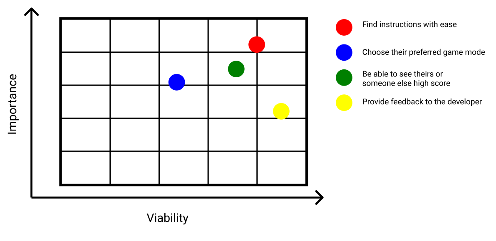
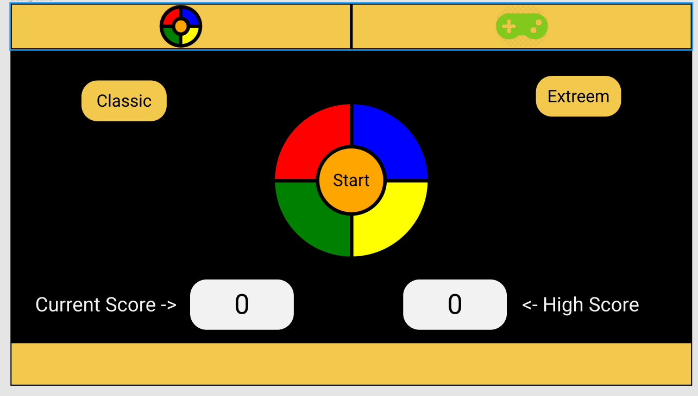

<h1 align="center">
  Simon Says Color Game
</h1>
  
<h2 align="center">
  How long can you go!?
</h2>
  
<div align="center">
  Simon says color game is a memory game in which player follows the color pattern that is shown. After each correctly followed round the color patter gets longer and longer: how long will you go?

[View the live project here](https://perkunaskf.github.io/msp2-games/)

</div>

## Table of contents
1. [UX](#UX)
    1. [Project Goals](#Project-Goals)
    2. [User Stories](#User-Stories)
    3. [Development Planes](#Development-Planes)
2. [Features](#Features)
3. [Issues and Bugs](#Issues-and-Bugs)
4. [Technologies Used](#Technologies-Used)
     1. [Main Languages Used](#Main-Languages-Used)
     2. [Frameworks, Libraries & Programs Used](#Frameworks-Libraries-&-Programs-Used)
5. [Testing](#Testing) ☞ **[Testing.md](TESTING.md)**
6. [Deployment](#Deployment)
     1. [Deploying on GitHub Pages](#Deploying-on-GitHub-Pages)
     2. [Forking the Repository](#Forking-the-Repository)
     3. [Creating a Clone](#Creating-a-Clone)
7. [Credits](#Credits)
     1. [Audio](#Audio)
     2. [Code](#Code)
***


***

## UX 
### Project Goals
The primary goal of "Simon Says Color Game" is to provide a web-based interactive game that is entertaining and usis the original "Simon (game)" made by: Ralph H. Baer and Howard J. Morrison. Gamme is designe to test and train players memmory skills.

This is the second of four Milestone Projects that the developer must complete during their Full Stack Web Development Program at The Code Institute. 

The main requirements were to design, develop and implement a dynamic front-end web application using **HTML5**, **CSS3** and **JavaScript**.

#### Player Goals
The player is looking for:
- A fun game to play.
- Instructions on how to play the game.
- An intuitive interface.
- A track of their achievements in the game.

#### Developer Goals
The Developer is looking to:
- Create a fun game to pass the time.
- Demonstrate their skills in software development, using newly learned languages and libraries.
- Deploy a project on their portfolio.

### User Stories
**As a player, I want to:**

1. Intuitive controls.
2. Have a score counter and a high score board to see how well am I doing.
3. Get a visual feedback to see when the game starts and when it is over.
4. Provide feedback to the developer to improve the game.
5. Get easy to find and understand instruction on how to play the game.

### Development Planes

To create and design a web-based interactive game, the developer distinguished the necessary functionality of the game and how it would answer to the user stories:

<strong>1. <u>Strategy</u></strong>

Broken into two categories, the website will focus on the following target audiences:
- **Roles:**
     - New Players
     - Current Players
     - Returning Players

- **Demographic:**
     - Chalenge lovers
     - Age 5 years and up

The website needs to enable the **user** to:
- Find instructions with ease
- Choose their preferred game mode
- Be able to see theirs or someone else high score
- Provide feedback to the developer

With these goals in mind, a strategy table was created:



<strong>2. <u>Scope</u></strong>

A scope was defined to clearly identify what needed to be done to align features with the strategy:
- **Content Requirements**
     - The user will be looking for:
          - Easy to find instruction
          - Current accumulated score
          - High score board
          - Appealing game environment
- **Functionality Requirements**
     - The user will be able to:
          - Responsive game design
          - Clearly defined interactive elements
          - Clearly define game area
          - Toggle between game modes
          - Send feedback to the developer

<strong>3. <u>Structure</u></strong>

The entire game was fitted in one page for ease of use and all information is easily reached true the main page. The **hierarchial tree structure**:


<strong>4. <u>Skeleton</u></strong>

Wireframe mockup was created in a [Figma Workspace](https://www.figma.com/file/vt1vlEaqolTvRzSvSoxpvp/Color-Game?node-id=0%3A1 "Link to Blank! Figma Workspace"). The original design was not kept because it provided to high on a screen so some of the information was not usable. Also the design was too plain and not as appealing.



[Back to top ⇧](#table-of-contents)

## Features
All features are responsive and intuitive:
- **Reset** - On the top left corner there is an icon witch will reset the game any time the player wishes.
- **Tutorial** - On the top right corner there is an icon witch will open tutorial container with the game instructions and other game features.
- **Start/Score/Game Over** - In the middle of the screen there is the game area with four colors and the start, start button changes into the current score holder after the game starts. And changes into the game over indicator after the player make a mistake.
- **Classic/Extreme** - On the left side of the screen there is a mode button after click the game mode changes from classic to extreme.
- **High score** - On the right side of the screen there is a better high score achieved indicator also functions as a button to open high score board.
- **Feedback** - On the bottom left corner there is and icon which will open feedback forum after clicking it.

[Back to top ⇧](#table-of-contents)

## Issues and Bugs 
The developer ran into a number of issues during the development of the game, with the noteworthy ones listed below, along with solutions.

**All color blink at once** - At the early stages of the game development, developer ran into a bug where all colors blink at once. The console log testing message was showing the correct number pattern (every color had a number assigned for faster bug tracking), But the color would flash at once. A solution was found on https://stackoverflow.com/ (Also new feature learned). The code is going fast and so the color seem to blink at the same time, by adding **setTimeout** functions to the for loop developer manage to get all the color to blink in 0,5 s intervals.

**Same color patter blink only once** - After getting the same color in a row, more than once, the color only blinks ones. The solution was to add a **setTimeout** function after the entire loop, seen the color blink starts without a pause. Now, after each blink there is a 0.5 s delay before the color blink.

**Answer Eco** - After clicking the color button you would get multiple same values. A solution was found on https://stackoverflow.com/. Add a Jquarry functionality to the button witch would save only one click and send only one value ($('#id').off().on()('click', function(){})).

**After wrong answer double patter** - After clicking the wrong color two color patterns would start. The problem was that game start function would start simultaneously at the game over pattern. Simply adding one extra if statement fixed this problem.

**Sound not playing on a hosted page** - While implementing a sound for color blinks, a bug occurred where there was no sound on the hosted page, but he previews page was playing the sound. After careful inspection of the code problem was found on the directory link, there was one extra '/' at the beginning of the directory ink.

**After mistake Start button not clickable** - After game over palter the start button would not reset and be clickable again. The problem was in the index.html file. The button was put inside the red button div witch is disabled before the start of the game. So after disabling the div the start button would become disabled as well. Moved the start button to it own container, that fixed the problem.

**Game loads on top of the screen** - In higher screen game would load on top of the screen. The solution was to make a container witch was fixed to the middle of the screen and put all of the content inside the container.

[Back to top ⇧](#table-of-contents)

## Technologies Used
### Main Languages Used
- [HTML5](https://en.wikipedia.org/wiki/HTML5 "Link to HTML Wiki")
- [CSS3](https://en.wikipedia.org/wiki/Cascading_Style_Sheets "Link to CSS Wiki")
- [JavaScript](https://en.wikipedia.org/wiki/JavaScript "Link to JavaScript Wiki")

### Frameworks, Libraries & Programs Used
- [Bootstrap](https://getbootstrap.com/ "Link to Bootstrap page")
     - Bootstrap was used to implement the responsiveness of the site, using bootstrap classes.
- [jQuery](https://jquery.com/download/ "Link to jQuery page")
     - jQuery was used to simplify the JavaScript code used.
- [Google Fonts](https://fonts.google.com/ "Link to Google Fonts")
    - Google fonts was used to import the font "Roboto".
- [Font Awesome](https://fontawesome.com/ "Link to FontAwesome")
     - Font Awesome was used for graphical indication of features buttons.
- [Git](https://git-scm.com/ "Link to Git homepage")
     - Git was used for version control by utilizing the GitPod terminal to commit to Git and push to GitHub.
- [GitHub](https://github.com/ "Link to GitHub")
     - GitHub was used to store the project after pushing.
- [jQuery Validation](https://jqueryvalidation.org/ "Link to jQuery Validation page")
     - jQuery Validation was used to simplify form validation for the **Feedback Form**.
- [Figma](https://www.figma.com/ "Link to Figma homepage")
     - Figma was used to create the wireframes during the design phase of the project.
- [Am I Responsive?](http://ami.responsivedesign.is/# "Link to Am I Responsive Homepage")
     - Am I Responsive was used in order to validate the responsiveness of the design.

[Back to top ⇧](#table-of-contents)

## Testing

Testing information can be found in a separate testing [file] Prideti testing fila

## Deployment

This project was developed using [Visual GitHub](https://github.com/ "Link to GitHub site").

## Deployment

This project was developed using [Visual Studio Code Insiders](https://code.visualstudio.com/insiders/ "Link to Visual Studio Code site"), committed to git and pushed to GitHub using the computer terminal.

### Deploying on GitHub Pages
To deploy this page to GitHub Pages from its GitHub repository, the following steps were taken:

1. Log into [GitHub](https://github.com/login "Link to GitHub login page") or [create an account](https://github.com/join "Link to GitHub create account page").
2. Locate the [GitHub Repository](https://github.com/PerkunasKF/msp2-games "Link to GitHub Repo").
3. At the top of the repository, select Settings from the menu items.
4. Scroll down the Settings page to the "GitHub Pages" section.
5. Under "Source" click the drop-down menu labelled "None" and select "Master Branch".
6. Upon selection, the page will automatically refresh meaning that the website is now deployed.
7. Scroll back down to the "GitHub Pages" section to retrieve the deployed link.
8. At the time of submitting this Milestone project the Development Branch and Master Branch are identical.

### Forking the Repository
By forking the GitHub Repository we make a copy of the original repository on our GitHub account to view and/or make changes without affecting the original repository by using the following steps:

1. Log into [GitHub](https://github.com/login "Link to GitHub login page") or [create an account](https://github.com/join "Link to GitHub create account page").
2. Locate the [GitHub Repository](https://github.com/PerkunasKF/msp2-games "Link to GitHub Repo").
3. At the top of the repository, on the right side of the page, select "Fork".
4. You should now have a copy of the original repository in your GitHub account.

### Creating a Clone
How to run this project locally:
1. Install the [GitPod Browser](https://www.gitpod.io/docs/browser-extension/ "Link to Gitpod Browser extension download") Extension for Chrome.
2. After installation, restart the browser.
3. Log into [GitHub](https://github.com/login "Link to GitHub login page") or [create an account](https://github.com/join "Link to GitHub create account page").
2. Locate the [GitHub Repository](https://github.com/PerkunasKF/msp2-games "Link to GitHub Repo").
5. Click the green "GitPod" button in the top right corner of the repository.
This will trigger a new gitPod workspace to be created from the code in github where you can work locally.

How to run this project within a local IDE, such as VSCode:

1. Log into [GitHub](https://github.com/login "Link to GitHub login page") or [create an account](https://github.com/join "Link to GitHub create account page").
2. Locate the [GitHub Repository](https://github.com/PerkunasKF/msp2-games "Link to GitHub Repo").
3. Under the repository name, click "Clone or download".
4. In the Clone with HTTPs section, copy the clone URL for the repository.
5. In your local IDE open the terminal.
6. Change the current working directory to the location where you want the cloned directory to be made.
7. Type 'git clone', and then paste the URL you copied in Step 3.
```
git clone https://github.com/USERNAME/REPOSITORY
```
8. Press Enter. Your local clone will be created.

Further reading and troubleshooting on cloning a repository from GitHub [here](https://docs.github.com/en/free-pro-team@latest/github/creating-cloning-and-archiving-repositories/cloning-a-repository "Link to GitHub troubleshooting")

[Back to top ⇧](#table-of-contents)

## Credits 

### Audio
The sound effects and song lyrics that are used in this website are for educational purposes only. There is no copyright infringement intended.

Sorce for sound effects used: [Freesound](https://freesound.org/ "Link to ")

### Code 
The developer consulted multiple sites in order to better understand the code they were trying to implement. For code that was copied and edited, the developer made sure to reference this within the code. The following sites were used on a more regular basis:
- [Stack Overflow](https://stackoverflow.com/ "Link to Stack Overflow page")
- [W3Schools](https://www.w3schools.com/ "Link to W3Schools page")
- [Bootstrap](https://getbootstrap.com/ "Link to BootStrap page")

[Back to top ⇧](#table-of-contents)
