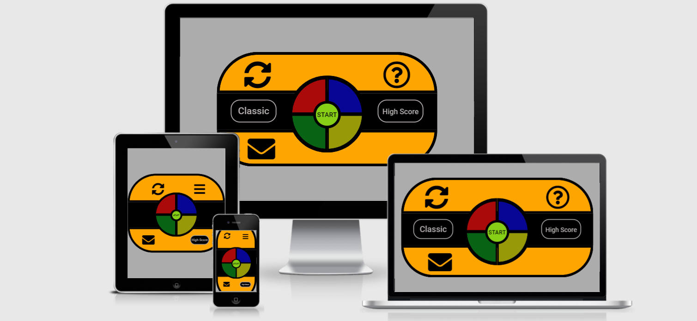

<h1 align="center">
  Simon Says Color Game
</h1>

<h1 align="center"> Testing </h1>

[Main README.md file](README.md "Link to README file")

[View live project](https://perkunaskf.github.io/msp2-games/ "Link to Live project")

[View website in GitHub Pages](https://github.com/PerkunasKF/msp2-games "Link to Blank! Repository")

***
## Table of contents
1. [Testing User Stories](#Testing-User-Stories)
2. [Manual Testing](#Manual-Testing)
3. [Automated Testing](#Automated-Testing) 
     - [Code Validation](#Code-Validation)
     - [Browser Validation](#Browser-Validation)
     - [Lighthouse Auditing](#Lighthouse-Auditing)
4. [User Testing](#User-Testing)

***

***
