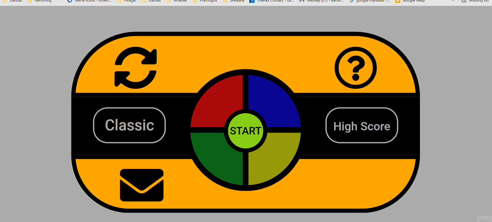
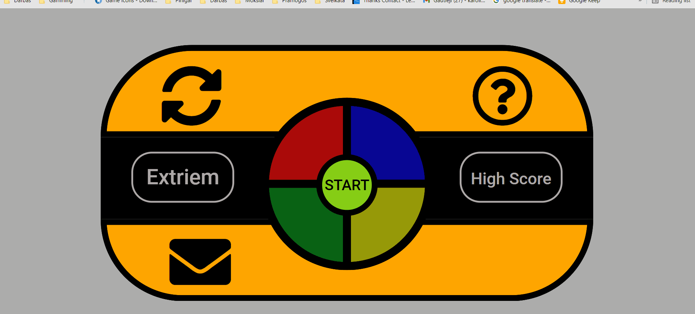

<h1 align="center">
  Simon Says Color Game
</h1>

<h1 align="center"> Testing </h1>

[Main README.md file](README.md "Link to README file")

[View live project](https://perkunaskf.github.io/msp2-games/ "Link to Live project")

[View website in GitHub Pages](https://github.com/PerkunasKF/msp2-games "Link to Blank! Repository")

***
## Table of contents
1. [Testing User Stories](#Testing-User-Stories)
2. [Manual Testing](#Manual-Testing)
3. [Automated Testing](#Automated-Testing) 
     - [Code Validation](#Code-Validation)
     - [Browser Validation](#Browser-Validation)
     - [Lighthouse Auditing](#Lighthouse-Auditing)
4. [User Testing](#User-Testing)

***

***
## Testing User Stories

#### Player Goals:
1. As a player I am looking for a fun game to play:
    - Game page features a colorful and pleasing design for the player.
    - All functions are responsive and easy to understand.
    - The game is supported on all screen sizes for ease of use.
2. As a player I am looking for instructions on how to play the game:
    - The tutorial button is easy to find on top of the screen with a clear icon. 
    - On mouse cursor hover mouse cursor changes to indicate icon is interactive. 
    - On click a box with all instructions and features pop up in the middle of the screen.
3. As a player I am looking for intuitive interface:
    - Reset button has an icon witch intuitively means reset the game. 
    - Tutorial button has an icon witch intuitively mean to ask something. 
    - Mode changing button changes on click to indicate which mode player is using. 
    - High score button is clearly defined and marked by "High Score" text. 
    - Feedback button is defined by an envelope icon.
    - Start button is clearly defined in the middle of the screen with "START" text. 
    - Game area is clearly defined and designed to be in the middle of the screen. 
    - The shape of the game area is designed to look like the original Symon Says game.
4. As a player I am looking for a track of my achievements in the game:
    - Clicking high score button pops up a high score board for classic and extreme game modes. 
    - On achieving high enough score player gets to write down their name or nickname. 
    - The high score is saved on their browser so they can always see their high achievement.

[Back to top ⇧](#table-of-contents)

## Manual Testing

- Clicking the hovering over interactive elements will change the cursor and the button styles:

    

- Clicking the **Reset Button** will reset current game: 

    

- Clicking **Tutorial Button** will pop up tutorial explanations:

    

- Playing on a classic mode game will show the same pattern and will make it longer:

    
    
- Playing on extreme mode game patter will be random and will keep getting longer:

    
    
- Clicking on **High Score Button** will make a high score board to pop up:

    
    
- Clicking on **Feedback Button** will make feedback form to pop up:

    

[Back to top ⇧](#table-of-contents)
